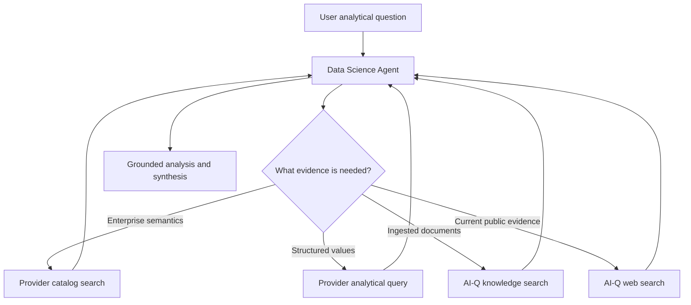

<!--
SPDX-FileCopyrightText: Copyright (c) 2026, NVIDIA CORPORATION & AFFILIATES. All rights reserved.
SPDX-License-Identifier: Apache-2.0
-->

# Data Science Agent

The Data Science Agent is an adaptive ReAct controller for questions that need
enterprise structured data, document evidence, public web evidence, or a
combination of those sources. It owns discovery, tool selection, analysis, and
final synthesis in one continuous message history.

**Location:** `src/aiq_agent/agents/data_science/`

The agent is exposed through two boundaries that share the same ReAct runtime:

- `data_science_workflow` starts it directly for local development and
  evaluation, without invoking the top-level router.
- `data_science_hybrid_adapter` accepts the catalog-aware Chat Researcher state
  when a product workflow selects Hybrid research.

## Tool integration

The agent receives tools through NeMo Agent Toolkit references and the
`data_source_registry`; it does not contain provider clients. One
`ontology_provider` assignment identifies the configured provider's catalog,
analytical, and optional predictive tools.

- The configured catalog tool discovers query-relevant ontology candidates and
  coverage.
- The configured analytical tool generates and executes a bounded structured-data
  query through the selected provider.
- `knowledge_search` uses the configured AI-Q knowledge backend.
- `web_search_tool` uses the configured AI-Q web-search provider.
- `python`, when configured through `sandboxed_python`, runs self-contained
  scientific Python scripts in a fresh OpenShell sandbox per request. It is
  also a non-citable utility.

An empty `tools` list inherits every registry tool. A non-empty list is an
explicit override, and `exclude_tools` can remove exact runtime tool names.
Per-request `data_sources` filtering uses the same registry mapping as the
shallow and deep researchers.

## Runtime flow



Ontology-provider calls are made sequentially so each later question can use
exact entities or values observed earlier. Document and web searches should be
narrow enough to represent distinct evidence needs. The final answer goes
through AI-Q's source registry, citation verification, and report sanitization.

The optional request-local structured-data guard enforces configured catalog and
text-to-SQL call limits, serializes calls, caches exact repeats, and records
compact evidence diagnostics (coverage/candidate counts or row counts and
truncation). The agent prompt complements that boundary with an evidence ledger,
one broad catalog-discovery pass, consolidated analytical requests, and bounded
repair rules. Limits are opt-in so the general direct profile remains tunable.

For analyses that require pandas, NumPy, SciPy, scikit-learn, or statsmodels,
the `sandboxed_python` NAT function launches a fresh, bounded Python process for
each tool call inside one attested OpenShell sandbox owned by the DS request.
Variables do not persist, so every call must be a self-contained script. The
model sees a single `python(code)` tool and does not manage sandbox or workspace
identifiers. Every successful structured-data SQL response is persisted under a
stable request-local reference (`structured_1`, `structured_2`, and so on). Before every
script, AI-Q copies the complete authoritative receipt set into the sandbox
through a bounded manifest whose paths are rewritten to sandbox-local files.
The trusted runner exposes
`list_analysis_results()`, `analysis_result(ref)`, `analysis_rows(ref)`,
`analysis_sql(ref)`, and `analysis_latest()`, so analysis consumes exact rows
rather than copying values from the conversation. The runner has no configured
source-database or ontology-provider client; all retrieval remains an agent-level
operation. Network access is blocked,
application credentials are never included in the sandbox specification, and
normal completion, failure, timeout, or cancellation deletes the request-owned
sandbox. Hard per-script limits bound address space, CPU, process count, open
files, and file size. No host-process execution backend is available.

The DS runtime also reserves a final model call before the LangGraph recursion
boundary. When that reserve begins, tools are removed and the model must
synthesize from collected evidence. In `fdabench_choice` mode, a missing or
malformed leading `Answer:` line receives one no-tool format-repair call.

## Direct local run

Copy `deploy/.env.example` to `deploy/.env` and set:

- `AIQ_DATA_SCIENCE_MODEL`
- `INFERENCE_NVIDIA_API_KEY`
- `AIQ_INFERENCE_BASE_URL`
- `TAVILY_API_KEY`
- `GSF_BASE_URL`
- `GSF_EMAIL`
- `GSF_PASSWORD`
- `RAG_SERVER_URL`
- `COLLECTION_NAME`

Optional variables include `GSF_READ_TIMEOUT_SECONDS`,
`RAG_RETRIEVAL_TIMEOUT_SECONDS`, `RAG_VERIFY_SSL`, and
`AIQ_DS_INTERACTION_MODE`. Then run:

```bash
./scripts/start_cli.sh --config_file configs/config_cli_data_science.yml
```

The shipped local profile uses GSF with password-session authentication. Product
integration should omit that auth block and rely on AI-Q's request-scoped user
token forwarding. Snowflake and Databricks profiles use their respective
function groups and replace the provider, registry tools, and router catalog
tool as shown in the provider package READMEs.

The direct CLI profile uses the Foundational RAG backend for knowledge
retrieval. Its ingestion URL is intentionally fail-closed because this profile
only searches an existing collection. TLS verification remains enabled by
default; trusted test routes using a self-signed chain can set
`RAG_VERIFY_SSL=false` locally.

## Async execution

A data-science run routinely takes several minutes, which is longer than a
browser tab can be relied on to stay open. The agent is therefore submitted as
an async job rather than held open on a request: the HTTP call returns a
`job_id` immediately and the run continues in a Dask worker. Closing or
refreshing the page does not cancel it, and reconnecting to the same `job_id`
replays the stored events and returns the final report.

This reuses the shared async job API described in
[REST API](../../integration/rest-api.md); no data-science-specific endpoint
exists. The agent is registered as `data_science` in the async agent registry,
so it appears in `GET /v1/jobs/async/agents` whenever the active workflow
configures a `data_science_agent` function.

```bash
# Submit; returns immediately with a job_id
curl -X POST http://localhost:8000/v1/jobs/async/submit \
  -H 'Content-Type: application/json' \
  -d '{"agent_type": "data_science", "input": "Which regions missed forecast last quarter?"}'

# Reconnect at any time, including after a page refresh
curl -N http://localhost:8000/v1/jobs/async/job/<job_id>/stream

# Or resume from the last event a client already received
curl -N http://localhost:8000/v1/jobs/async/job/<job_id>/stream/<last_event_id>
```

Serve the web profile, which adds the `aiq_api` front end:

```bash
dotenv -f deploy/.env run nat serve \
  --config_file configs/config_web_data_science.yml --port 8000
```

Async jobs run in a worker that reloads the config file, so
`NAT_CONFIG_FILE` must point at the same profile and
`NAT_DASK_SCHEDULER_ADDRESS` must be set. Without them the submit route is
replaced by a guarded stub that returns 503.

### Routing from the chat UI

`configs/config_web_data_science_hybrid.yml` wires the agent into the chat
router so a browser request can reach it. Three pieces are required together:

- `intent_classifier` must use `_type: context_aware_intent_router`. The plain
  `intent_classifier` has no `hybrid_research` route, so DS is unreachable
  without this regardless of the rest.
- `data_science_hybrid_adapter` must be defined with an `agent` reference.
- `workflow.hybrid_research_agent` must point at that adapter.

The router probes the GSF catalog on each research request. A request carrying
an explicit `database_name` always takes the Hybrid path; an unscoped request
takes it only when catalog coverage clears `catalog_confidence_threshold`,
otherwise it falls back to shallow or deep. That threshold is deployment
specific and needs tuning against real catalog content.

When a submitter is configured the router submits DS as an async job and
returns a `job_escalation` message carrying the job id, which the web UI
consumes exactly as it does a deep-research job. Without a submitter — the
synchronous CLI, which has no job store — the hybrid route still runs inline.

### Behavior differences from a synchronous run

- **Interaction mode is forced to `headless`.** A worker has no channel back to
  the user, so a clarifying question would strand the job in a terminal
  question instead of an answer. Clarification is a pre-submission concern,
  exactly as it is for deep research. The configured `interaction_mode` is
  honored only on the synchronous CLI path.
- **Progress is streamed as SSE events**, not returned in one response. Tool
  calls, model turns, and the citation-verified final report are emitted
  through the standard job event stream.
- **Sandbox concurrency caps apply.** When `AIQ_MAX_SANDBOXES_PER_PRINCIPAL` or
  `AIQ_MAX_SANDBOXES_GLOBAL` is set, submissions are capped for agents that
  reach a sandbox — including through the `stateful_python` tool, which owns
  the sandbox reference rather than the agent config.
- **Per-request analysis artifacts still belong to the run.** The temporary
  analysis directory and any OpenShell sandbox are created and released inside
  the agent run, so cancellation and expiry release them the same way a
  synchronous run does.

## Product Hybrid integration

The context-aware Chat Researcher router performs one bounded GSF catalog probe
before selecting Hybrid research. Configure the adapter as the workflow's
optional Hybrid function:

```yaml
functions:
  data_science_agent:
    _type: data_science_agent
    llm: data_science_llm

  data_science_hybrid_adapter:
    _type: data_science_hybrid_adapter
    agent: data_science_agent

workflow:
  _type: chat_deepresearcher_agent
  hybrid_research_agent: data_science_hybrid_adapter
```

The adapter maps the original conversation, selected data sources, user
context, validated database scope, catalog result, and catalog request ID into
the DS Agent state. The prompt presents that catalog result as preloaded
semantic routing context, so the agent does not repeat the same broad discovery
call. Catalog candidates remain non-evidentiary and are never treated as query
rows.

Direct evaluation does not use this adapter. FDABench tasks continue to enter
through `data_science_workflow` with no preloaded catalog context, leaving the
ReAct agent free to decompose a mixed-source task and formulate focused catalog
searches itself.

## Non-interactive evaluation

Set `AIQ_DS_INTERACTION_MODE=headless` for benchmark and batch execution. The
agent then uses semantic discovery to resolve ambiguity, discloses defensible
assumptions, and never waits for a user response. If the model still emits a
clarification request, the runtime performs one bounded synthesis retry; a
second clarification becomes a terminal non-interactive limitation.

## FDABench-Lite profiles

Two direct profiles isolate the planned ablation without involving the shallow
researcher or top-level router:

- `configs/config_cli_data_science_fdabench_lite.yml` runs DS ReAct with GSF,
  Foundational RAG, and Tavily.
- `configs/config_cli_data_science_fdabench_lite_python.yml` keeps the same
  model, source tools, structured-data limits, and response contract, and adds
  only the stateless OpenShell scientific Python runner with exact result helpers.

Both profiles are headless and set `response_mode: fdabench_choice`. When a task
contains labeled choices, the prompt evaluates every option and emits an
`Answer:` line first while retaining rationale and sources below it. Report-style tasks
without choices still receive the standard analytical report. The benchmark
adapter must include the target database name and complete answer choices in the
user request.

Required benchmark variables are `AIQ_DATA_SCIENCE_MODEL`,
`INFERENCE_NVIDIA_API_KEY`, `AIQ_INFERENCE_BASE_URL`, `GSF_BASE_URL`,
`GSF_EMAIL`, `GSF_PASSWORD`, `RAG_SERVER_URL`, `COLLECTION_NAME`, and
`TAVILY_API_KEY`. Optional
`AIQ_DS_STRUCTURED_CATALOG_CALL_LIMIT` and `AIQ_DS_STRUCTURED_TEXT_TO_SQL_CALL_LIMIT`
override the profile defaults of two and six actual calls, respectively. Exact
request-local cache hits do not consume those budgets.
`AIQ_DS_PYTHON_CALL_LIMIT`, `AIQ_DS_PYTHON_TIMEOUT_SECONDS`,
`AIQ_DS_PYTHON_MAX_EVIDENCE_BYTES`, `AIQ_DS_PYTHON_MAX_MEMORY_MB`, and
`AIQ_DS_PYTHON_MAX_CPU_SECONDS` tune the sandboxed analysis runtime;
`AIQ_DS_FINALIZATION_MODEL_CALL_LIMIT` tunes the reserved finalization turn. The
Python profile additionally requires a configured OpenShell gateway, the
scientific Python image, and an offline policy selected through
`AIQ_DS_OPENSHELL_IMAGE` and `AIQ_DS_OPENSHELL_POLICY_FILE`. Follow the
OpenShell deployment guide before running that profile.

These profiles configure the runtime surface only; they do not bundle FDABench
data, RAG documents, database files, endpoint URLs, or credentials.

## Current boundaries

- The context-aware router provides the Hybrid dispatch hook, but shipped
  profiles must explicitly configure `data_science_hybrid_adapter` to select
  this agent.
- The public GSF function group exposes `text_to_pql`, but the current DS Agent
  profiles intentionally include only catalog search and text-to-SQL;
  predictive routing remains outside this integration.
- Atomic-question clarification is planned separately and is not part of the
  direct workflow.
- The ReAct message/tool trajectory is observable through NAT tracing. Benchmark
  DAG materialization is not part of the production agent contract.
